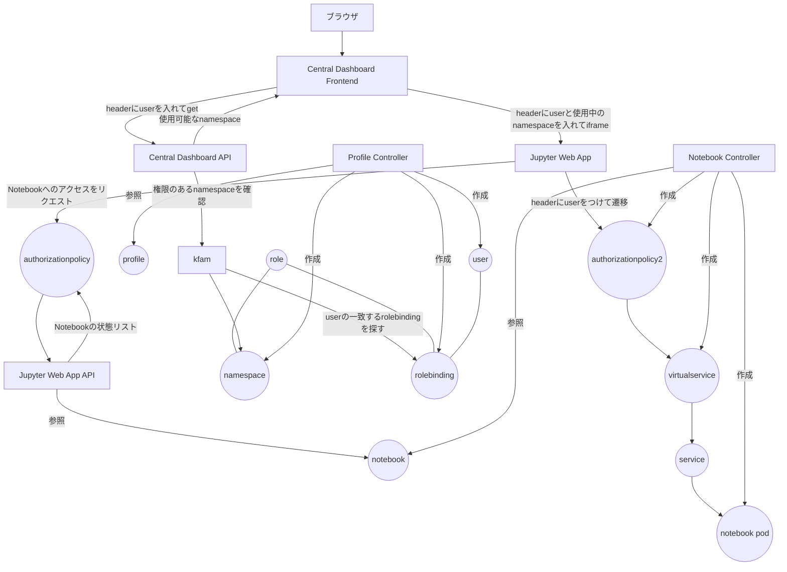
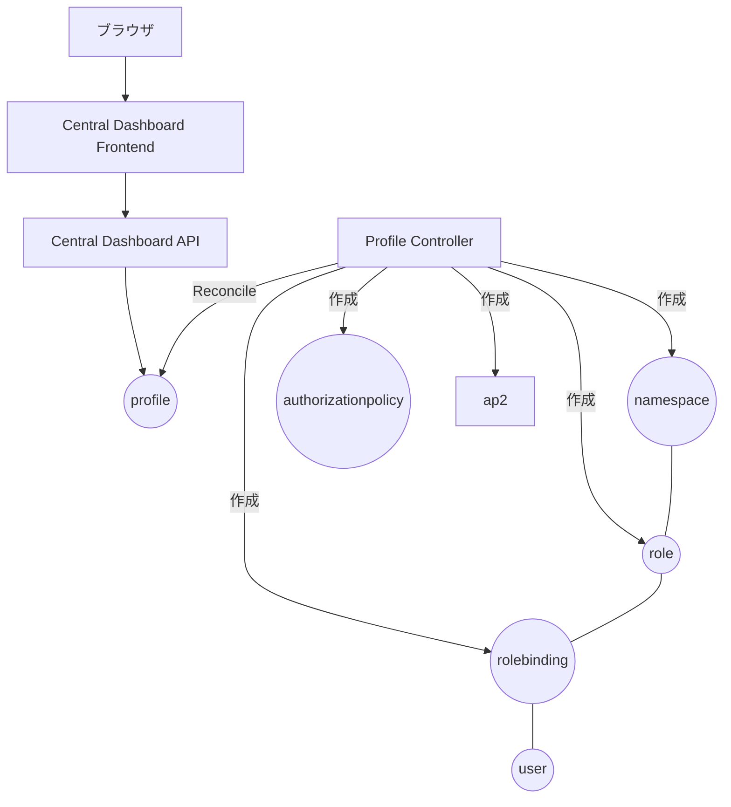
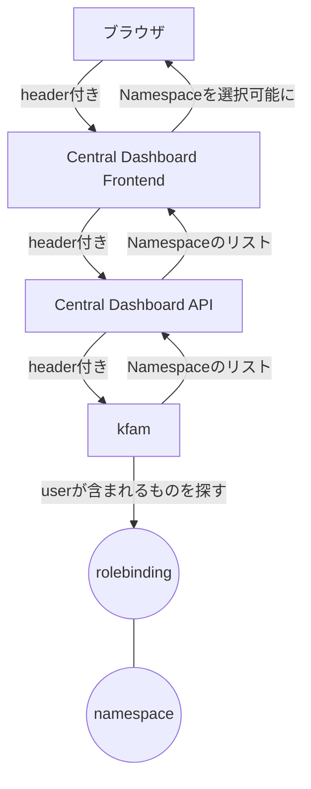
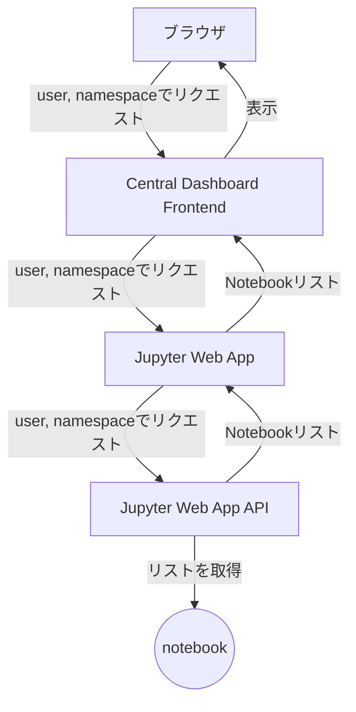
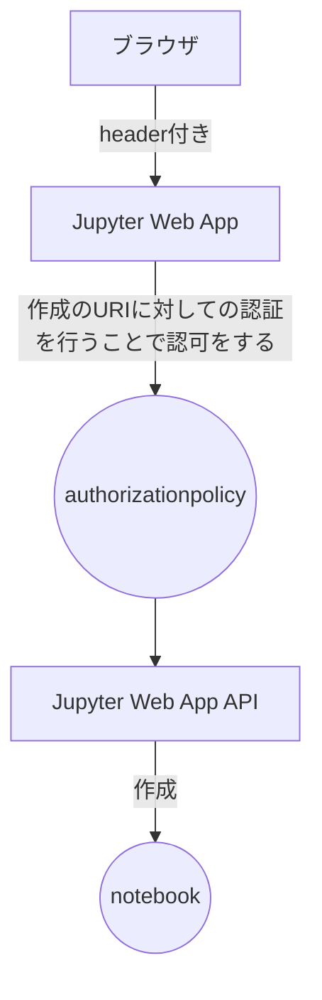
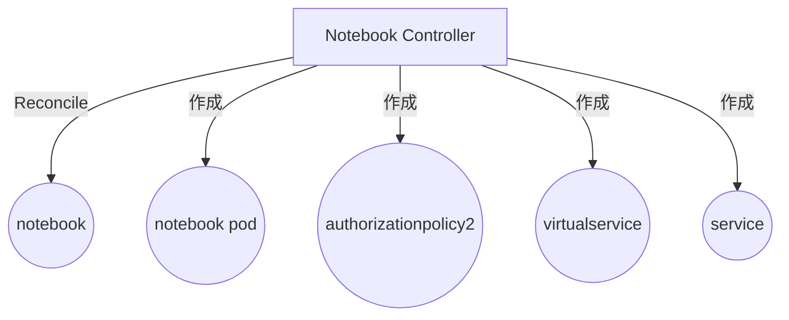
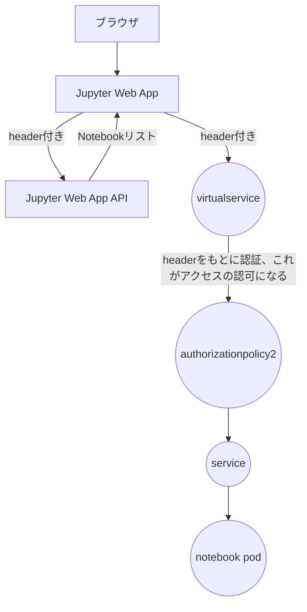

Ciliumを使用したクラスタでKubeflowの認証を機能させるべく、認証のフローを追ったのでその記録をば。  

## ユーザがKubeflow Notebooksを開くまで
つらつらと思いつくがままにmermaidに起こしたらとんでも無いことになったので、  
1. ユーザーがアカウントの無い状態でアクセスし、Profile作成から出来上がるリソース
2. Central DashboardでNamespaceが読み込まれるまで
3. Notebookのリストを取得するまで
4. Notebookを作成するまで
5. NotebookのPodが立ち上がるまで
6. Notebookを開くまで

に分けて起きることを説明していく。

## ユーザーがアカウントの無い状態でアクセスし、Profile作成から出来上がるリソース
1. アカウントが無い状態でCentral Dashboard (CD) にアクセスするとregistration flowに入る (環境変数でON/OFF可)
1. フォームに名前を入力するとkind: Profileが作成される
1. Profile ControllerがNamespace, Role, RoleBinding, Userを作る

## Central DashboardでNamespaceが読み込まれるまで
1. headerにuserが書かれた状態でCDに遷移する
2. CDがCD API (/api以下) にリクエストする
3. backend serverがkfamにリクエストし、userがrolebindingされているnamespaceを取得する

## Notebookのリストを取得するまで
1. ユーザーがNotebookのページに遷移する
2. headerにuserがあることを確認し、Jupyter Web App (JWA) が開き、JWA APIからnotebookのリストを取得する

## Notebookを作成するまで
1. ユーザーが新規作成を押す
2. JWAがAPIを叩く、この際、権限が表現されたAuthorizationPolicyによって認可が行われる
3. APIがNotebookを作成する

## NotebookのPodが立ち上がるまで
1. Notebook ControllerがNotebookを検知する
2. VirtualService, Service, Podを作る
3. Profile ControllerがAuthorizationPolicyを作る

## Notebookを開くまで
1. ユーザーのリクエストによってJWAが再度Notebookのリストを取得
2. Notebookを開き、/namespace/nameで表現されるアドレスへアクセスする
3. このとき、authorizationPolicy2で認証が行われる
4. Notebookが開く

## おわりに
以上のようにheaderとProfile, User, Namespaceを1対1対応にしてKubeflowは認証を行っており、この構造が既存のKubernetesクラスターとのmergeを難しくさせている。  
特にNotebook Controllerが作るVirtualServiceは`hosts: ["*"]`がハードコーディングされていて複数のドメインを使用しないことが前提となっていたりして工夫が必要である。  
分かりやすくしようと頑張ったが、だいぶ煩雑になってしまった。。。  
次回はCiliumへの置き換えの戦略について書こうかな。

こちらの記事は以下のリポジトリで管理されています。  
誤字脱字、間違い、分かりづらい点、質問等がありましたら、Issueを立てて頂けると幸いです。  
https://github.com/japan4415/zenn-contents